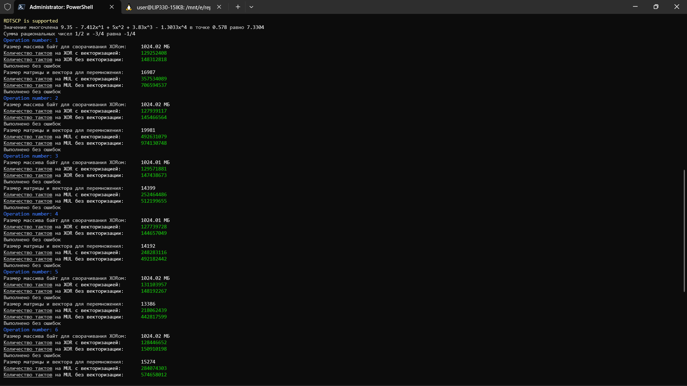

# Тестовые задания

Набор из четырёх тестовых [заданий](doc/tasks.pdf) для разработчика солвера.

**Проект находится в разработке.**

## Сборка

Проект написан в Vsual Studio 2022 под Windows, конфигурации Debug и Release настроены только для платформы x64.

Также есть возможность собрать проект с помощью CMake под Linux или Windows, в директории с файлом `CMakeLists.txt`:

    mkdir build
    cd build
    cmake ..
    cmake --build .

### Тестовое задание #1

Файлы, относящиеся к этому заданию:

    vxor.h
    vxor.cpp
    
Побайтовое исключающее или для массивов больших размером (в тестах от одного гигабайта до двух минус один байт). Реализовано на основе SSE2 и AVX2 (векторизация с помощью SIMD-инструкций, а именно XOR двух 128-битных или 256-битных векторов) с использованием OpenMP (распараллеливание на максимально доступное количество логических ядер). Демонстрируется функцией `runTest1Ex()`, которая использует референтную реализацию алгоритма для проверки оптимизированного варианта (сверяет байты). Функция `runTest1()` тоже относится к этому заданию, но служит для наглядной проверки референтной реализации алгоритма.

***Оптимизированное решение на моей машине показало себя не с лучшей стороны, но всё же превосходит референтную реализацию по скорости (см. скриншот ниже).***

### Тестовое задание #2

Файлы, относящиеся к этому заданию:

    peval.h
    
Это простая реализация метода Горнера. Демонстрируется функцией `runTest2()`.

### Тестовое задание #3

Файлы, относящиеся к этому заданию:

    rational.h
    
Реализация представления рационального числа в виде обыкновенной дроби, для нахождения НОД используется алгоритм Евклида. Демонстрируется функцией `runTest3()`.

### Тестовое задание #4

Файлы, относящиеся к этому заданию:

    mmul.h
    mmul.cpp

Умножение квадратной матрицы на вектор-столбец больших размеров (в тестах от 1 250 мегабайт на квадратную матрицу из 64-битных даблов и 100 килобайт на вектор-столбец до в два раза больше минус один). Демонстрируется функцией `runTest4Ex()`, которая, также как и в задании #1, использует референтную реализацию алгоритма для проверки оптимизированного варианта (сверяет полученные вектора-столбцы). Внешний цикл (цикл по строкам матрицы) распараллеливается с помощью OpenMP. Внутренний цикл (умножение строки матрицы на вектор) обрабатывается с помощью SIMD-инструкций AVX. Когда OpenMP параллелит внешний цикл на максимально доступное количество логических ядер, каждый поток обрабатывает одну строку матрицы. Внутри каждого потока выполняется поэлементное SIMD-умножение частей строки матрицы и вектора-столбца, загруженных в векторные регистры по четыре числа с плавающей точкой двойной точности (64-битные) в каждом из двух векторов на одну итерацию, и два SIMD-сложения, одно из которых горизонтальное (попарное) сложение вектора, полученного после умножения, самого с собой и одно вертикальное (поэлементное) сложение вектора, полученного после предыдущего горизонтального сложения, самого с собой, но с предварительной перестановкой частей (пополам) у второго, всё это с помощью AVX-интринсиков. Таким образом, оба метода (OpenMP и AVX) работают вместе для параллельной и векторизованной обработки данных.

***Оптимизированное решение на моей машине показало себя достойно. Звёзд с неба не хватает, но превосходит референтную реализацию по скорости (хоть и не на порядок) и не уступает ей по точности (нет быстрого накопления ошибки).***

***Тестирование выполнялось в однопоточном режиме.***
